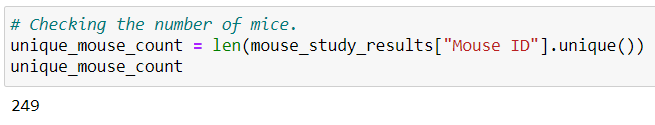
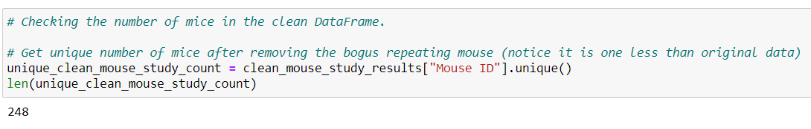
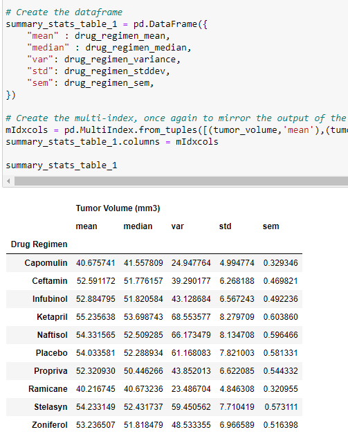
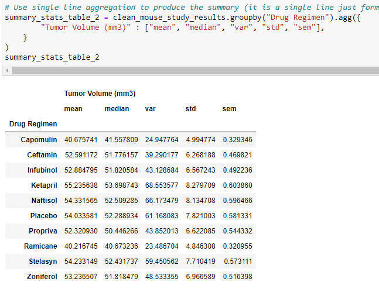
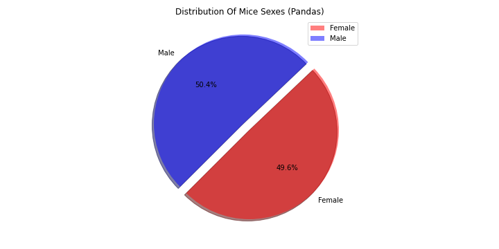
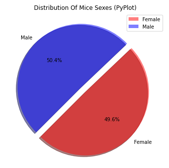

# Pymaceuticals

- **_Pymaceuticals_** - A [Juypter Notebook](pymaceuticals.ipynb) The purpose of this study was to compare the performance of Pymaceuticals' drug of interest, Capomulin, versus the other treatment regimens. You have been tasked by the executive team to generate all of the tables and figures needed for the technical report of the study. The executive team also has asked for a top-level summary of the study results.

## Files

- PyCitySchool Files

  - [Mouse MetaData](data/Mouse_metadata.csv) - Source file for the mouse data to be processed

  - [Study Results Data](data/Study_results.csv) - Source file for the study results data to be processed

  - [`pymaceuticals.ipynb`](pymaceuticals.ipynb) - The Juypter Notebook for processing the [Mouse MetaData](data/Mouse_metadata.csv) and [Study Results Data](data/Study_results.csv)

## Results

All results can seen below, as well as, reviewed in the [Juypter Notebook](pymaceuticals.ipynb)

1. Removing the mouse with duplciated data

   - Count before

   

   - Count After (1 mouse dropped out)

   

1. Summary Statistics

   - With Series

   

   - With Aggregation

   

1. Bar Charts - Total Number of Unique Mice By Regimen

   - With Pandas

   

   - With PyPlot

   

## Observations

1. Observation 1

1. Observation 2

## Execution

1. The assumption is that you have a working Python 3.6, Jupyter Notebook 6.1.4, Pandas 1.0.5, matplotlib 3.2.2, scipy 1.5.0, and numpy 1.18.5
1. Clone the [`git repository`](https://github.com/jayhjman/matplotlib-challenge) for this project
1. Change into the [`repository directory`](https://github.com/jayhjman/matplotlib-challenge) the [`pymaceuticals.ipynb`](pymaceuticals.ipynb) will be in the top level directory, no need to change to any sub-directory
1. Execute `jupyter notebook` via command line
1. Jupyer Notbook will open and once it does, select the file [`pymaceuticals.ipynb`](pymaceuticals.ipynb)
1. This will execute against the `csv` files found in [Mouse MetaData](data/Mouse_metadata.csv) and [Study Results Data](data/Study_results.csv) under `data` directory
1. Please execute `Kernal > Restart & Run All` from the Jupyter Notebook menu to see the results

## Author

Made by Jay with :heart: in 2020.
